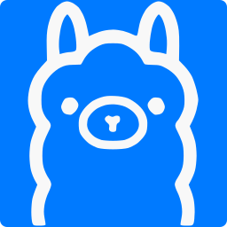
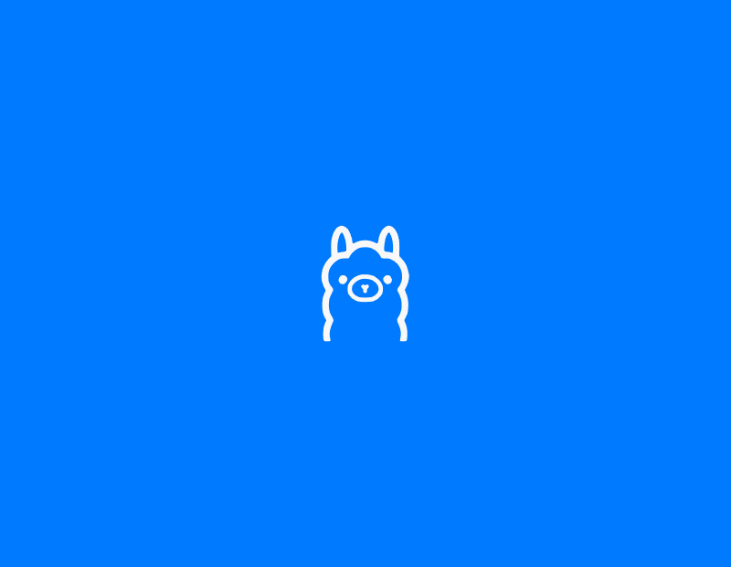
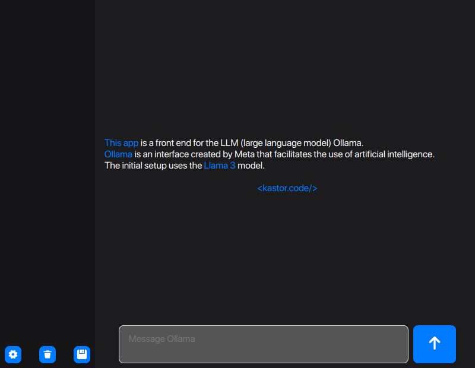
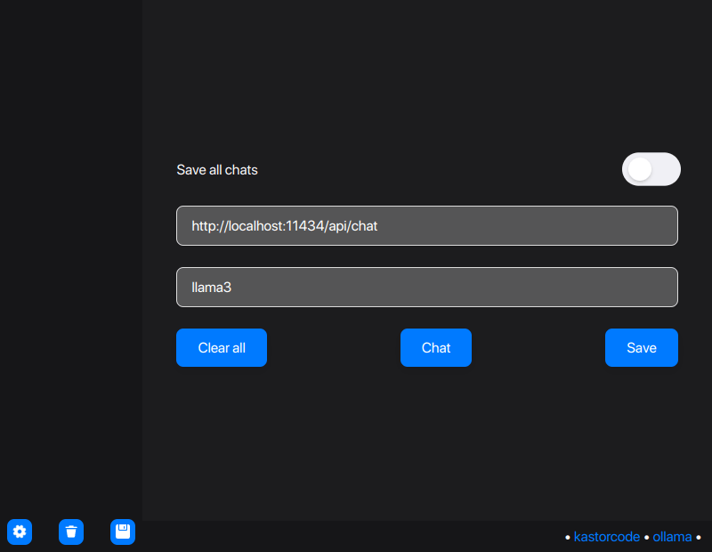
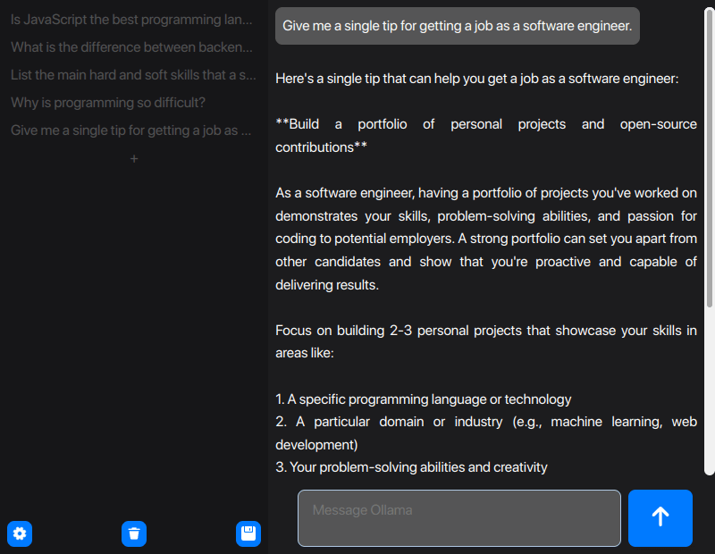
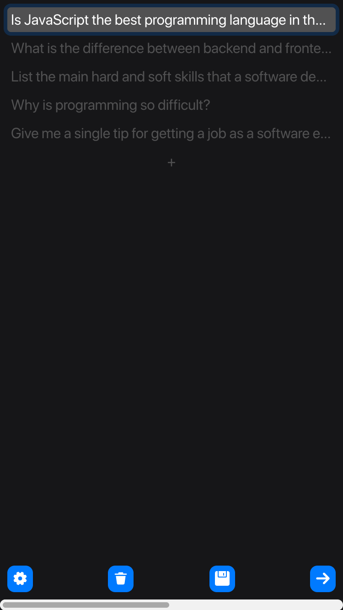
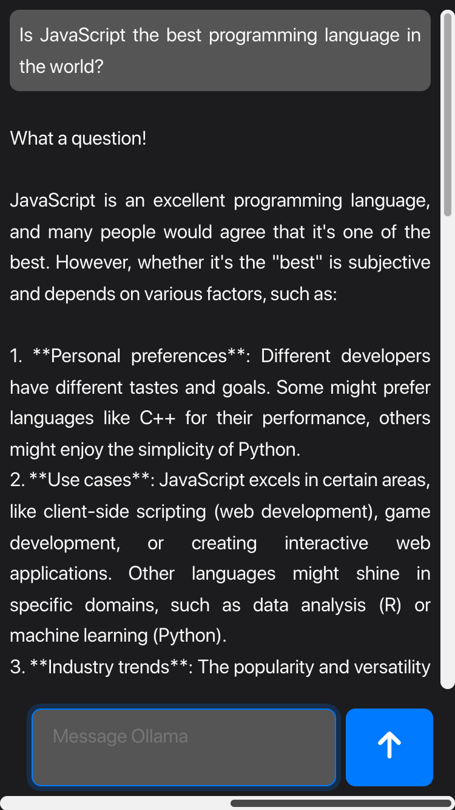

## Ollama LLM Graphical User Interface

## Software Reco multimodal mode

This fork is the active UI for `software_reco`. The chat composer supports up to
four PNG/JPEG/WebP attachments, image-only questions, local previews, and retrieved
image evidence cards. Requests are sent to the Spring endpoint configured by
`REACT_APP_CHAT_API_URL` (default: `http://localhost:8080/api/chat`).

Raw base64 image data is kept only in the live chat state and is omitted from
localStorage autosave. Build and test with:

```bash
npm install
npm test -- --watchAll=false --runInBand
npm run build
```

> 👨‍💻 Developed by Matheus Ramalho de Oliveira  
🏗️ Brazilian Software Engineer  
✉️ kastorcode@gmail.com  
🦫 [LinkedIn](https://br.linkedin.com/in/kastorcode) • [Instagram](https://instagram.com/kastorcode)

---

<p align="center">
  
</p>

<p align="center">
  This application is a frontend for the LLM (large language model) Ollama. Ollama is an interface created by Meta that facilitates the use of artificial intelligence.
</p>

---

### Screenshots

<p align="center">
  
  
  
  
  
  
</p>

---

### Technologies
[Craco](https://craco.js.org)  
[Flux Architecture](https://facebookarchive.github.io/flux)  
[React.js](https://react.dev)  
[React Hooks Global State](https://npmjs.com/package/react-hooks-global-state)  
[React Router](https://reactrouter.com)  
[React Transition Group](https://reactcommunity.org/react-transition-group)  
[Styled Components](https://styled-components.com)  
[TypeScript](https://typescriptlang.org)

---

### Installation and execution

1. You need to have the [Ollama server](https://ollama.com/download) installed on your machine, or configure the app to use an external URL;
2. Make a clone of this repository;
3. Open the project folder in a terminal;
4. Run `yarn` to install dependencies;
5. Run `yarn start` to launch at `http://localhost:3000`.

---

### Running from GitHub Pages

1. You need to have the [Ollama server](https://ollama.com/download) installed on your machine, or configure the app to use an external URL;
2. By default, the app uses the llama3 model, you can install it with the command: `ollama run llama3`;
3. If you have the local server, run it with the following command releasing CORS: `export OLLAMA_ORIGINS=https://*.github.io && ollama serve`;
4. Access at: [kastorcode.github.io/ollama-gui-reactjs](https://kastorcode.github.io/ollama-gui-reactjs).

---

<p align="center">
  <big><b>&lt;kastor.code/&gt;</b></big>
</p>