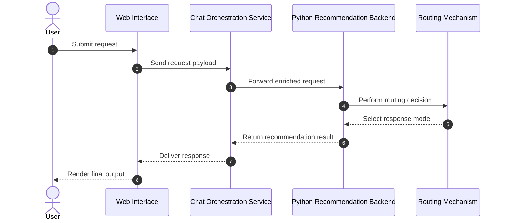
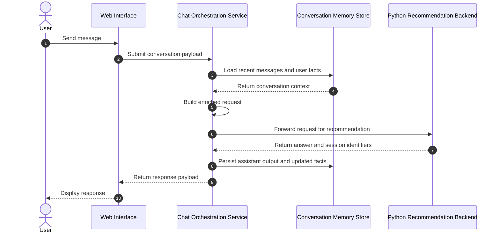
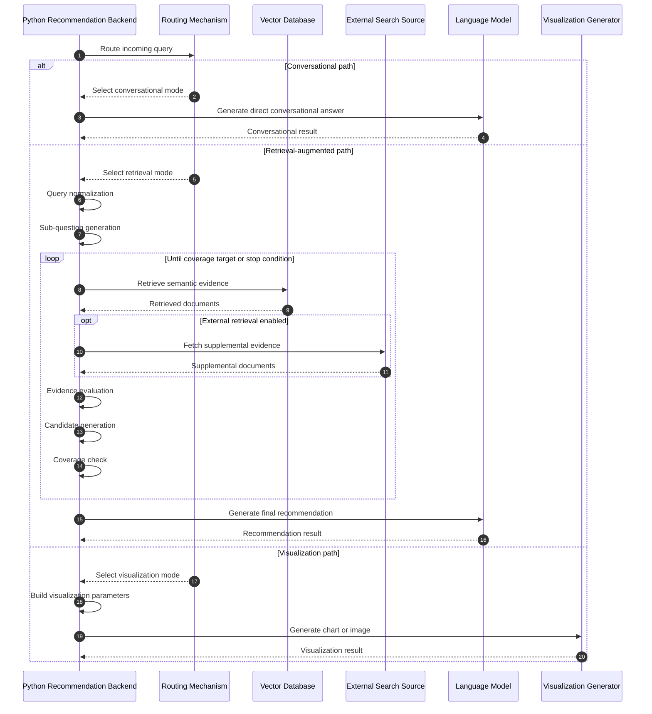
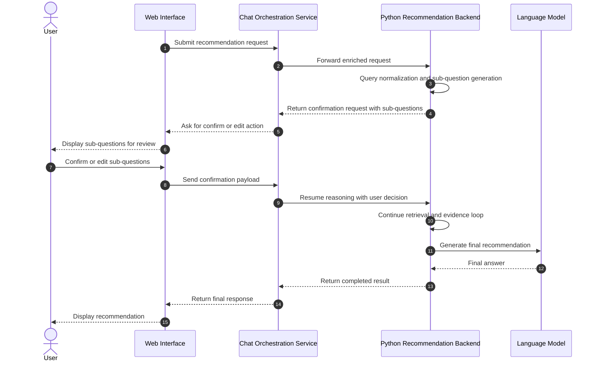

# Software Engineering Recommendation System

## Progress Report

Date: February 17, 2026

## System Architecture

Our system adopts a layered architecture, facilitating stable conversational interaction and retrieval-enhanced recommendation generation. Users engage via a web interface, with requests flowing through a chat orchestration service to reach a Python-powered recommendation backend. Such separation permits independent evolution of conversational state management and recommendation reasoning.

Within the recommendation backend, a routing mechanism chooses dynamically among conversational response generation, retrieval-enhanced recommendation, and visualization-oriented response generation. The retrieval-enhanced branch unfolds as a multi-stage reasoning workflow featuring explicit intermediate states, iterative evidence refinement, and termination control governed by coverage, iteration budget, and temporal constraints.

State continuity operates at dual levels. Initially, conversation-level memory preserves user facts and recent message history. Subsequently, workflow-level checkpointing enables resumable reasoning requiring human confirmation. This dual-memory approach enhances continuity throughout multi-turn interactions while maintaining oversight of prolonged reasoning paths.

## Data Collection and Preparation

The ingestion subsystem accommodates mixed unstructured engineering content, encompassing plain text, markdown, and PDF materials. Raw documents undergo normalization into a consistent internal representation prior to downstream processing. Normalization eliminates invalid records, enforces content presence, and ensures metadata stability for uniform operation in subsequent stages.

Document preparation employs semantic chunking instead of naive fixed splitting. Text segmentation occurs initially by sentence boundaries adhering to both Chinese and English punctuation conventions. Chunks are subsequently assembled sentence-first to preserve local semantic coherence. When individual sentences surpass the target window, the pipeline reverts to bounded-length splitting. Controlled overlap remains between adjacent chunks, mitigating context fragmentation during retrieval.

Each chunk receives enrichment with structural provenance (source identity and positional offsets), permitting traceability from generated recommendations back to underlying evidence units.

## Vector Database Design

The system leverages a persistent vector database to decouple indexing from query-time retrieval. Chunk text, metadata, and embeddings are stored collectively within a dedicated recommendation collection, with write operations employing upsert semantics supporting repeatable ingestion sans destructive resets.

The storage design partitions vector and metadata responsibilities while presenting a unified query surface to the reasoning pipeline. This facilitates low-latency similarity retrieval and consistent evidence formatting for downstream candidate generation.

Observed database state in the current project snapshot:

- A single recommendation collection stands provisioned.
- Vector and metadata segments achieve initialization.
- Indexed vector count remains zero.

This aligns with the current ingestion corpus state, where no startup-ingest source files exist.

## Exploratory Data Analysis (EDA)

EDA in this phase centered on operational data readiness and state quality rather than model benchmarking.

Corpus and index readiness findings:

- Startup ingestion source file count: 0
- Provisioned vector collections: 1
- Indexed vectors: 0

Conversation memory findings from persisted session state:

- Total sessions: 16
- Total stored messages: 42
- Average stored messages per session: 2.62
- Sessions containing stored user facts: 8

These findings confirm active conversational memory while revealing underpopulation of the local retrieval corpus. This imbalance elucidates why recommendation quality currently relies more heavily on non-local evidence sources and model priors than on project-specific indexed knowledge.

## Confirmatory Data Analysis (CDA)

CDA assessed runtime behavior against expected engineering properties: input validation, successful completion, and failure mode transparency.

Observed API runtime outcomes in captured logs:

- Successful recommendation responses: 3
- Rejected malformed requests: 3
- Internal processing failures: 1

Validation behavior operates as intended: malformed payloads face rejection before entering the reasoning pipeline. Successful requests complete the full recommendation path, returning structured answers. The solitary internal failure occurred at a human-confirmation interruption boundary when executed outside the expected resumable context. This highlights a concrete reliability target for future hardening.

## Modeling Approach

The modeling strategy embodies a routed hybrid architecture featuring three response modes:

- Conversational mode for lightweight dialogue and memory-aware interaction
- Retrieval-enhanced mode for engineering recommendations requiring evidence
- Visualization mode for chart-oriented responses

Regarding recommendation tasks, the retrieval-enhanced mode applies a multi-stage pipeline:

1. Query normalization transforms raw user language into technical retrieval-oriented formulations and extracts explicit constraints.
2. Sub-question decomposition expands complex requests into analyzable units.
3. Optional human confirmation validates or revises sub-questions before expensive retrieval.
4. Evidence collection retrieves candidate support from the vector database and, when enabled, external live-search evidence.
5. Evidence evaluation estimates quality signals for each evidence bundle.
6. Candidate generation synthesizes recommendation options with rationale and trade-off structure.
7. Coverage checking determines whether another retrieval-evaluation cycle becomes necessary.
8. Final answer generation produces the recommendation from the strongest available candidate set.

This approach deliberately separates retrieval, reasoning, and response generation, enhancing controllability and diagnostic clarity compared to single-pass generation.

## Preliminary Results

The current implementation demonstrates a functioning end-to-end recommendation system possessing the following confirmed capabilities:

- Dynamic routing between conversational and retrieval-based reasoning
- Persistent conversational memory across sessions
- Multi-stage recommendation generation with iterative refinement logic
- Structured recommendation outputs including rationale and trade-offs
- Operational validation safeguards against malformed input

Simultaneously, empirical readiness checks reveal that local retrieval indexing remains unpopulated in the current workspace state. Consequently, retrieval depth from local corpus evidence proves limited at present, with recommendation grounding constrained by available external evidence and model inference.

## Engineering Design Decisions

Principal engineering decisions and their rationales follow:

- Sentence-aware chunking with overlap: enhances semantic continuity for retrieval vis-à-vis blunt fixed slicing.
- Persistent vector storage: enables reusable indexing and prevents repeated ingestion costs across restarts.
- Routed hybrid reasoning: reduces unnecessary retrieval latency for conversational queries while preserving depth for technical recommendation tasks.
- Iterative evidence loop with explicit termination controls: balances quality improvement against runtime constraints.
- Human confirmation checkpoint in the reasoning loop: introduces governance for ambiguous decomposition steps in high-impact recommendation queries.
- Dual-memory strategy (conversation state plus workflow checkpointing): enhances continuity and supports resumable processing.
- Gateway-separated chat orchestration: isolates conversational lifecycle management from recommendation reasoning complexity.

Such decisions collectively prioritize maintainability, observability, and controlled recommendation quality under realistic runtime constraints.
