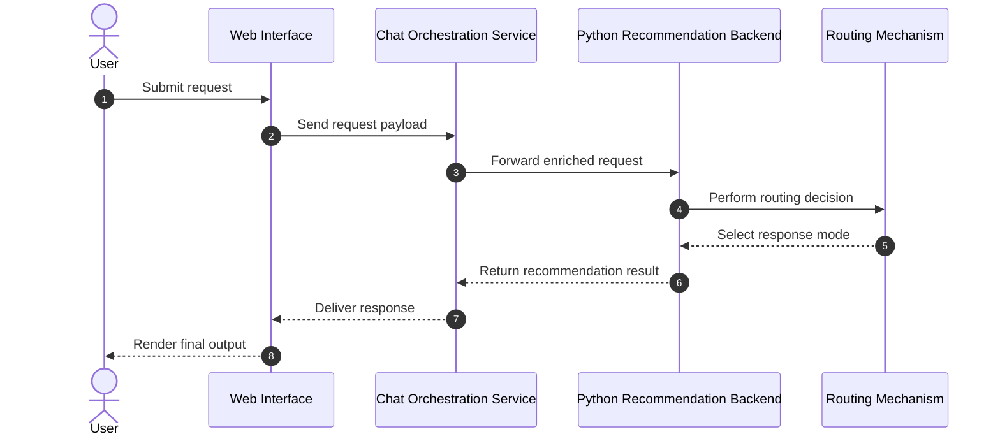
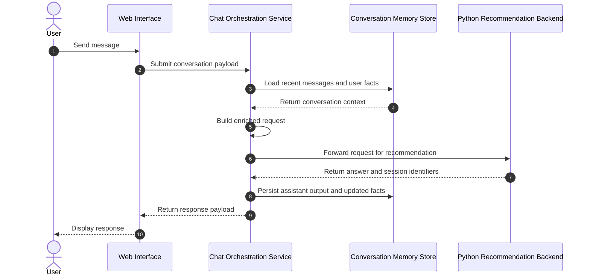
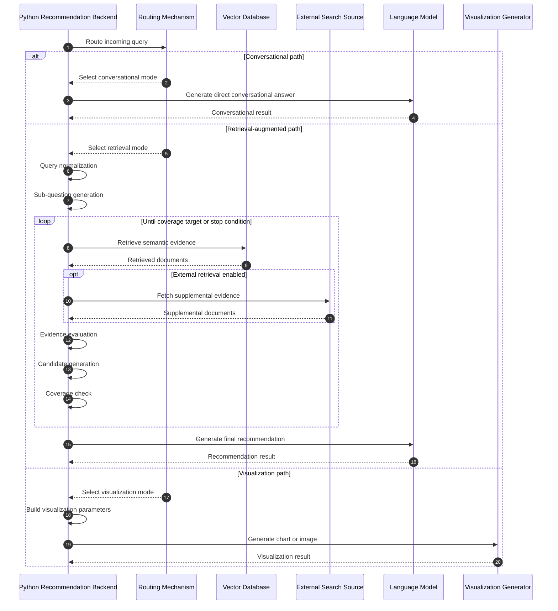
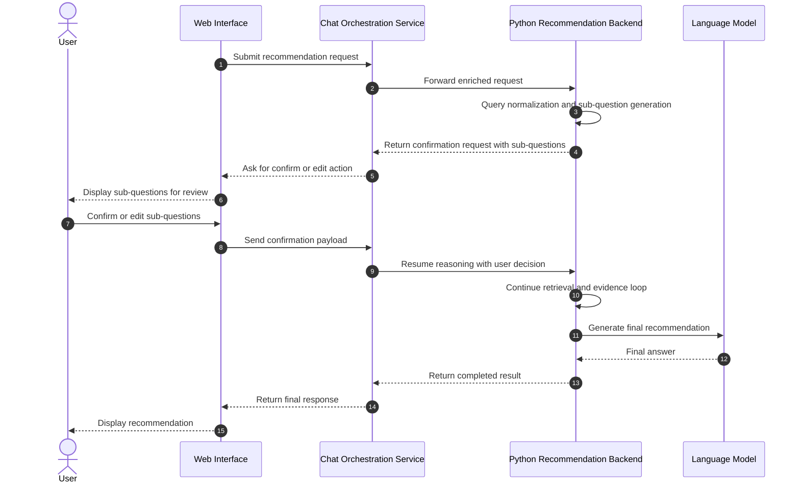

## 1. System Overview Diagram

```mermaid
sequenceDiagram
    autonumber
    actor U as User
    participant W as Web Interface
    participant C as Chat Orchestration Service
    participant P as Python Recommendation Backend
    participant R as Routing Mechanism

    U->>W: Submit request
    W->>C: Send request payload
    C->>P: Forward enriched request
    P->>R: Perform routing decision
    R-->>P: Select response mode
    P-->>C: Return recommendation result
    C-->>W: Deliver response
    W-->>U: Render final output
```

## 2. Chat Orchestration Workflow Diagram

```mermaid
sequenceDiagram
    autonumber
    actor U as User
    participant W as Web Interface
    participant C as Chat Orchestration Service
    participant S as Conversation Memory Store
    participant P as Python Recommendation Backend

    U->>W: Send message
    W->>C: Submit conversation payload
    C->>S: Load recent messages and user facts
    S-->>C: Return conversation context
    C->>C: Build enriched request
    C->>P: Forward request for recommendation
    P-->>C: Return answer and session identifiers
    C->>S: Persist assistant output and updated facts
    C-->>W: Return response payload
    W-->>U: Display response
```

## 3. Recommendation Reasoning Workflow Diagram

```mermaid
sequenceDiagram
    autonumber
    participant P as Python Recommendation Backend
    participant R as Routing Mechanism
    participant V as Vector Database
    participant X as External Search Source
    participant L as Language Model
    participant G as Visualization Generator

    P->>R: Route incoming query

    alt Conversational path
        R-->>P: Select conversational mode
        P->>L: Generate direct conversational answer
        L-->>P: Conversational result

    else Retrieval-augmented path
        R-->>P: Select retrieval mode
        P->>P: Query normalization
        P->>P: Sub-question generation
        loop Until coverage target or stop condition
            P->>V: Retrieve semantic evidence
            V-->>P: Retrieved documents
            opt External retrieval enabled
                P->>X: Fetch supplemental evidence
                X-->>P: Supplemental documents
            end
            P->>P: Evidence evaluation
            P->>P: Candidate generation
            P->>P: Coverage check
        end
        P->>L: Generate final recommendation
        L-->>P: Recommendation result

    else Visualization path
        R-->>P: Select visualization mode
        P->>P: Build visualization parameters
        P->>G: Generate chart or image
        G-->>P: Visualization result
    end
```

## 4. Human-in-the-Loop Confirmation Workflow Diagram

```mermaid
sequenceDiagram
    autonumber
    actor U as User
    participant W as Web Interface
    participant C as Chat Orchestration Service
    participant P as Python Recommendation Backend
    participant L as Language Model

    W->>C: Submit recommendation request
    C->>P: Forward enriched request
    P->>P: Query normalization and sub-question generation
    P-->>C: Return confirmation request with sub-questions
    C-->>W: Ask for confirm or edit action
    W-->>U: Display sub-questions for review
    U->>W: Confirm or edit sub-questions
    W->>C: Send confirmation payload
    C->>P: Resume reasoning with user decision
    P->>P: Continue retrieval and evidence loop
    P->>L: Generate final recommendation
    L-->>P: Final answer
    P-->>C: Return completed result
    C-->>W: Return final response
    W-->>U: Display recommendation
```
